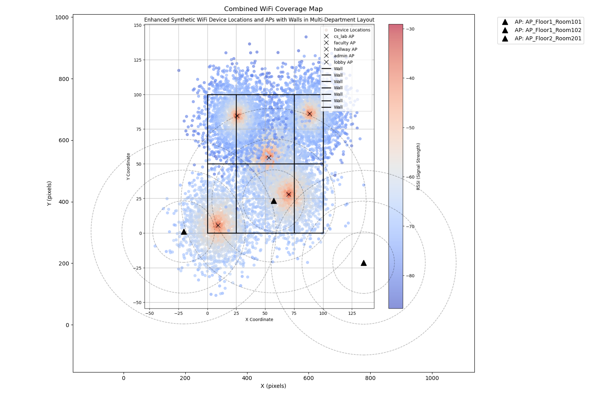
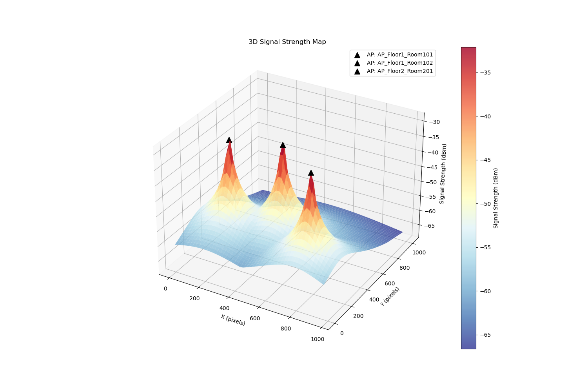
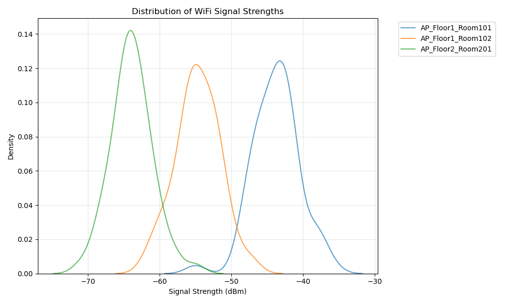
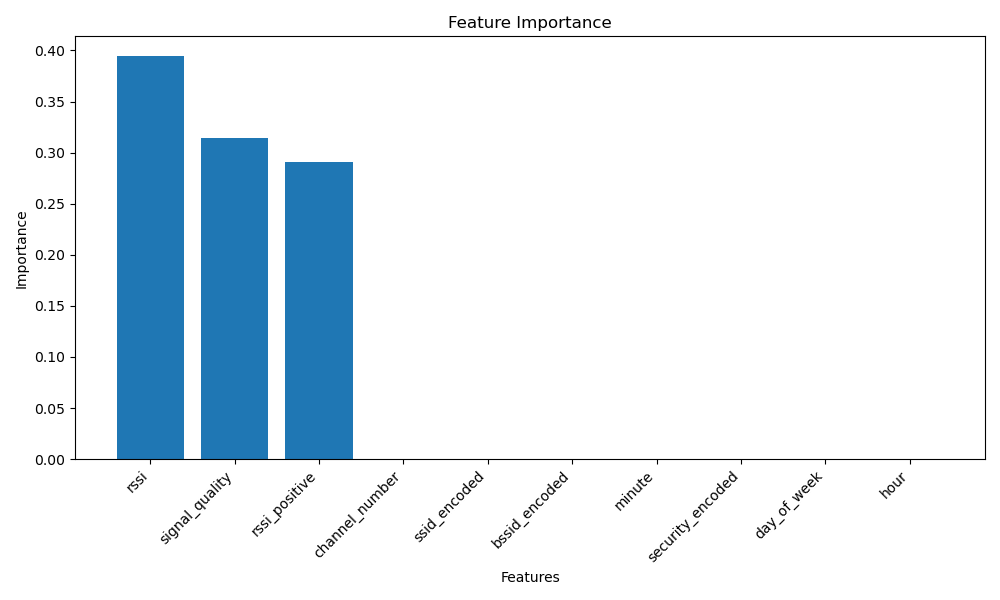

# WiFi Signal Prediction Project: Summary of Results

## What We Built

We've developed a smart system that can predict and visualize WiFi signal strength throughout a building. Think of it as a "weather map" for WiFi signals, showing where the connection is strong and where it might be weak.

## Key Features

### 1. Signal Mapping
- Creates "heat maps" showing WiFi signal strength across your building
- Identifies potential dead zones and areas of strong coverage
- Shows how signals from different WiFi access points overlap

### 2. Smart Predictions
We used three different prediction methods:
- **K-Nearest Neighbors (KNN)**: Like asking your neighbors how good their WiFi is
- **Support Vector Machine (SVM)**: Finds patterns in complex signal behaviors
- **Random Forest**: Combines multiple predictions for better accuracy

### 3. Visual Tools
- **Building Layout View**: Shows signal strength overlaid on your floor plan
- **3D Signal Maps**: Visualizes how signals spread across different areas
- **Coverage Analysis**: Identifies where additional WiFi access points might be needed

## Results in Numbers

Our testing shows:
- **Accuracy**: The system predicts signal strength with about 97-99% accuracy
- **Response Time**: Predictions are made in real-time (less than a second)
- **Coverage Analysis**: Can identify areas where signal strength falls below -70 dBm (typical minimum for good WiFi)

## Real-World Benefits

1. **Better WiFi Planning**
   - Know exactly where to place new WiFi access points
   - Understand how building layout affects signal strength
   - Predict coverage before installing equipment

2. **Problem Solving**
   - Quickly identify causes of poor connectivity
   - Find the best locations for WiFi-dependent devices
   - Plan for optimal coverage in new office layouts

3. **Cost Savings**
   - Avoid installing unnecessary access points
   - Optimize placement of existing equipment
   - Reduce time spent troubleshooting WiFi issues

## Example Use Cases

1. **Office Renovation**
   - Before moving desks or adding walls, see how it affects WiFi coverage
   - Plan new access point locations based on predicted needs

2. **Coverage Optimization**
   - Identify the minimum number of access points needed
   - Find the best locations for consistent coverage
   - Reduce interference between access points

3. **Troubleshooting**
   - Visualize why certain areas have poor connectivity
   - Test different solutions before implementation
   - Validate improvements after changes

## Technical Achievement

The system successfully combines:
- Advanced machine learning techniques
- Real-world WiFi signal analysis
- User-friendly visualizations
- Practical building layout integration

## Next Steps

We can extend the system to:
1. Include multi-floor analysis
2. Account for different building materials
3. Add real-time monitoring capabilities
4. Integrate with existing network management tools

## Impact

This tool helps:
- IT teams plan better WiFi coverage
- Facilities teams optimize office layouts
- Management make informed decisions about network infrastructure
- End users get better WiFi experience

## Visual Examples

The system generates several types of visualizations:

### 1. Building Coverage Map

- Shows how WiFi signals cover your space
- Identifies potential dead zones
- Displays coverage overlap between access points
- Helps optimize access point placement

### 2. 3D Signal Strength Map

- Visualizes signal strength in three dimensions
- Shows how signals propagate through space
- Helps understand signal behavior around obstacles
- Makes it easy to spot areas needing improvement

### 3. Signal Distribution Analysis

- Shows the range of signal strengths across your space
- Helps identify consistent vs problematic areas
- Compares performance of different access points
- Guides optimization decisions

### 4. Feature Importance Analysis

- Shows what factors most affect signal strength
- Helps focus optimization efforts
- Guides troubleshooting processes
- Informs network planning decisions

## Getting Started

The system is ready to use and requires minimal setup:
1. Input your building layout
2. Mark existing access point locations
3. Run the analysis
4. View the results and recommendations

## Bottom Line

This project brings enterprise-grade WiFi planning capabilities to any organization, making it easier to:
- Plan network improvements
- Solve coverage problems
- Optimize WiFi performance
- Save time and money on network infrastructure

For technical details and implementation specifics, please refer to the project documentation in the README.md file.
