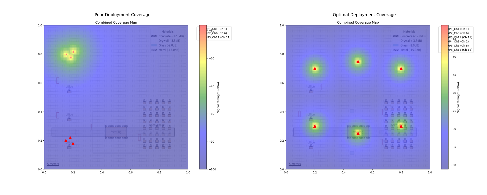
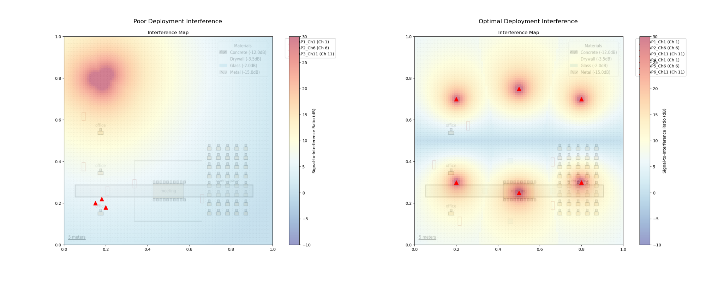

# WiFi Deployment Comparison Report

## Overview
This report compares two WiFi deployment scenarios:
1. Poor Deployment: Common mistakes and suboptimal choices
2. Optimal Deployment: Best practices and strategic planning

## Deployment Characteristics

### Poor Deployment
- Too few access points
- APs clustered in one area
- Overlapping channels causing interference
- Signal-blocking materials (metal walls)
- Large areas without coverage

### Optimal Deployment
- Strategic AP placement
- Non-overlapping channel assignment
- Signal-friendly materials
- Coverage optimized for different areas
- Redundancy in high-density areas

## Coverage Comparison

### Analysis
- Poor deployment shows significant dead zones and overlapping coverage
- Optimal deployment provides uniform coverage across the entire space
- Strategic AP placement ensures consistent signal strength

## Interference Analysis

### Analysis
- Poor deployment shows high interference in areas with clustered APs
- Optimal deployment minimizes interference through:
  * Strategic channel assignment
  * Proper AP spacing
  * Consideration of building materials

## Recommendations
1. **AP Placement**
   - Distribute APs evenly across the space
   - Consider user density in different areas
   - Account for building materials

2. **Channel Assignment**
   - Use non-overlapping channels (1, 6, 11 for 2.4GHz)
   - Plan channel reuse carefully
   - Consider interference from neighboring networks

3. **Coverage Planning**
   - Ensure minimum signal strength throughout
   - Plan for redundancy in critical areas
   - Account for different device types

4. **Material Considerations**
   - Use signal-friendly materials where possible
   - Add additional APs near signal-blocking materials
   - Consider window placement for signal propagation
