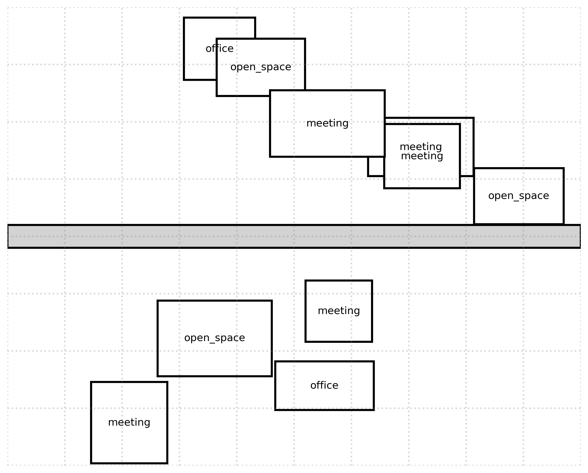

# Test Run Report: run_20241117_195111

Run Date: 20241117_195111

Description: WiFi Signal Prediction - Analysis

## Visualizations

### building_3d_map.png
Description: Building 3D Map

### building_heatmap_AP_office_3.png
Description: Building Heatmap Ap Office 3

### building_heatmap_AP_office_1.png
Description: Building Heatmap Ap Office 1

### building_heatmap_AP_meeting_2.png
Description: Building Heatmap Ap Meeting 2

### building_coverage.png
Description: Building Coverage

## Floor Plans

### 
Description: Synthetically generated office layout
