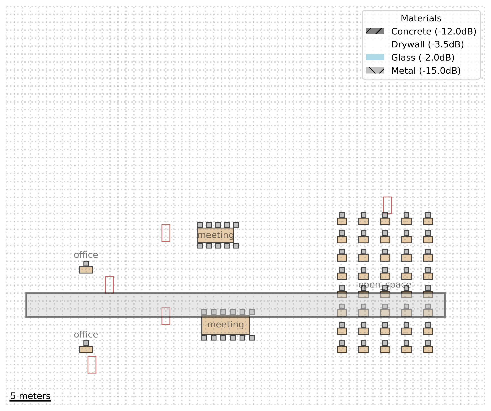

# Test Run Report: run_20241117_200112

Run Date: 20241117_200112

Description: Complete test with enhanced floor plans

## Model Performance

### knn
- rmse: 0.22125742736606563
- r2: 0.9510451508353501
- cv_rmse_mean: 0.28379846654288254
- cv_rmse_std: 0.0958280624066104

### svr
- rmse: 0.08034307290963467
- r2: 0.9935449906354371
- cv_rmse_mean: 0.18063873985764017
- cv_rmse_std: 0.10597174271186117

### rf
- rmse: 0.016375195194740313
- r2: 0.9997318529823341
- cv_rmse_mean: 0.0518165505554804
- cv_rmse_std: 0.028704979929962075

## Visualizations

### building_3d_map.png
Description: Building 3D Map

### svr_predictions.png
Description: Svr Predictions

### building_heatmap_AP_Office_1.png
Description: Building Heatmap Ap Office 1

### building_heatmap_AP_Meeting_1.png
Description: Building Heatmap Ap Meeting 1

### rf_predictions.png
Description: Rf Predictions

### building_heatmap_AP_OpenSpace_1.png
Description: Building Heatmap Ap Openspace 1

### signal_heatmap.png
Description: Signal Heatmap

### signal_distribution.png
Description: Signal Distribution

### feature_importance.png
Description: Feature Importance

### signal_over_time.png
Description: Signal Over Time

### building_coverage.png
Description: Building Coverage

### knn_predictions.png
Description: Knn Predictions

### model_comparison.png
Description: Model Comparison

## Floor Plans

### 
Description: Enhanced office layout with furniture and materials
