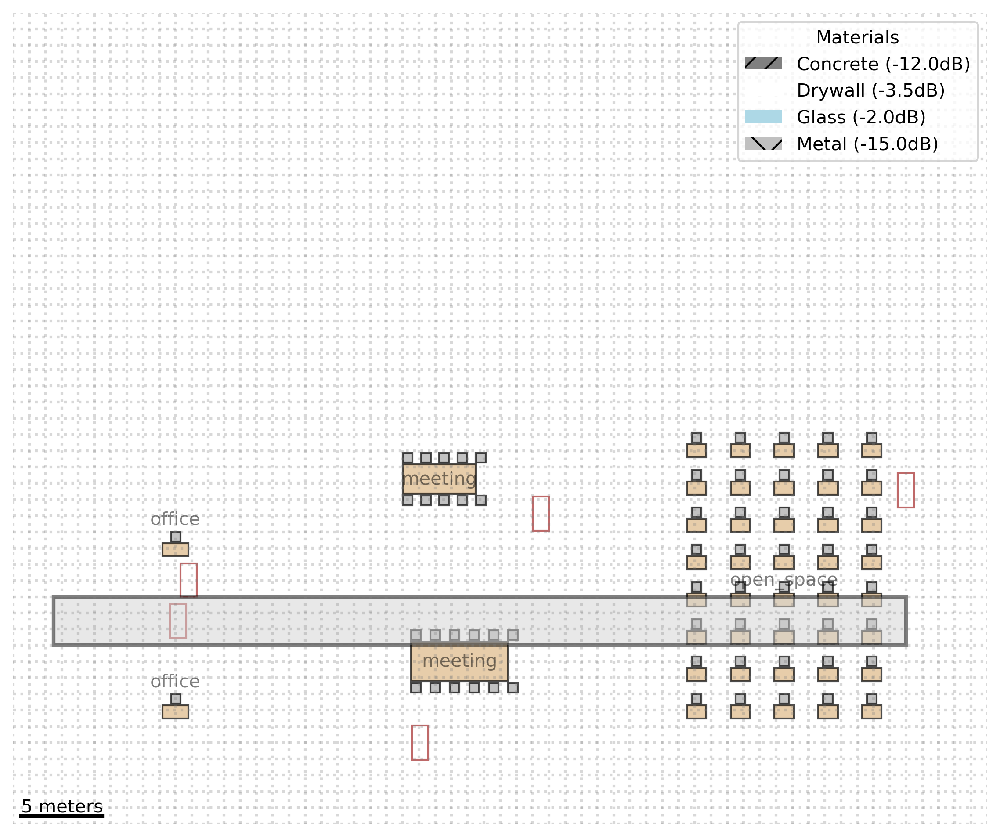

# Test Run Report: run_20241117_200931

Run Date: 20241117_200931

Description: Complete test with enhanced floor plans

## Model Performance

### knn
- rmse: 0.23806189018546892
- r2: 0.9433265364413218
- cv_rmse_mean: 0.353214947766967
- cv_rmse_std: 0.06695050967018945

### svr
- rmse: 0.11224875338657132
- r2: 0.9874002173631607
- cv_rmse_mean: 0.1946630665129951
- cv_rmse_std: 0.07784516981709105

### rf
- rmse: 0.02509246267757672
- r2: 0.9993703683167744
- cv_rmse_mean: 0.05574976908520748
- cv_rmse_std: 0.033657795945901216

## Visualizations

### building_3d_map.png
Description: Building 3D Map

### building_heatmap_AP_Office_1.png
Description: Building Heatmap Ap Office 1

### feature_importance_knn.png
Description: Feature Importance Knn

### building_heatmap_AP_Meeting_1.png
Description: Building Heatmap Ap Meeting 1

### prediction_accuracy_rf.png
Description: Prediction Accuracy Rf

### prediction_accuracy_knn.png
Description: Prediction Accuracy Knn

### feature_importance_rf.png
Description: Feature Importance Rf

### building_heatmap_AP_OpenSpace_1.png
Description: Building Heatmap Ap Openspace 1

### signal_distribution.png
Description: Signal Distribution

### signal_time_series.png
Description: Signal Time Series

### feature_importance_svr.png
Description: Feature Importance Svr

### building_coverage.png
Description: Building Coverage

### prediction_accuracy_svr.png
Description: Prediction Accuracy Svr

### model_comparison.png
Description: Model Comparison

## Floor Plans

### 
Description: Enhanced office layout with furniture and materials
