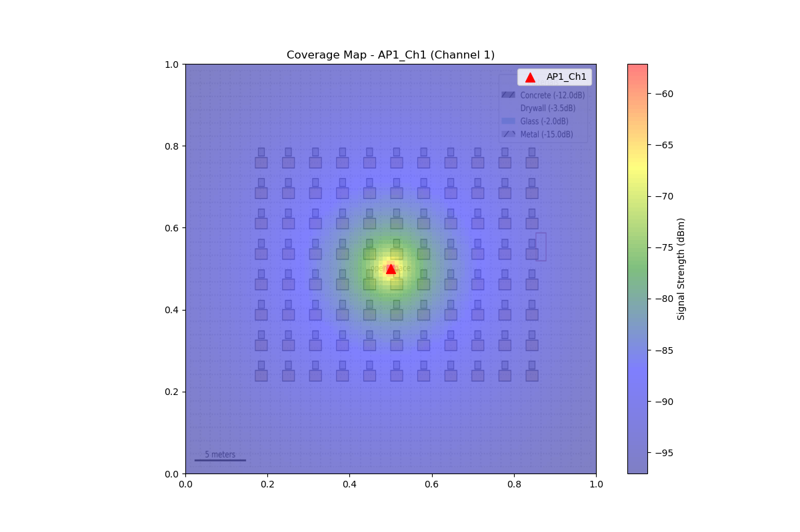
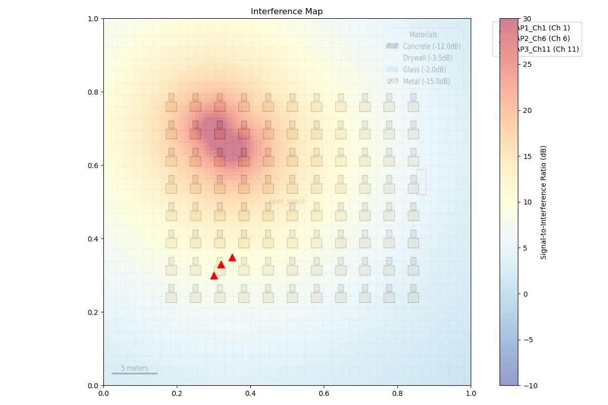
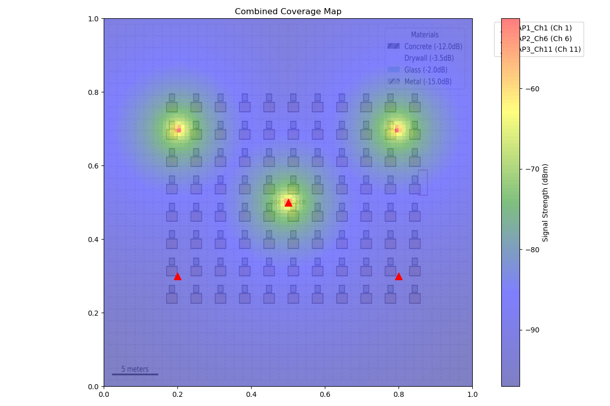

# How to Read WiFi Deployment Visualizations: A Simple Guide

## Introduction
This guide will help you understand the WiFi deployment visualizations in simple terms. Think of it like a weather map, but for WiFi signals instead of rain!

## Understanding the Colors
The colors in our maps work like a temperature gauge:
* 🔴 **Red** = Very Strong Signal (Like being right next to the router)
* 🟡 **Yellow** = Good Signal (Perfect for most uses)
* 🟢 **Green** = Okay Signal (Good enough for basic internet)
* 🔵 **Blue** = Weak Signal (Might have connection issues)
* 🟣 **Purple/Dark Blue** = Very Weak Signal (Probably won't connect)

## Access Points (APs)
* Look for the red triangles (▲) on the maps - these are your WiFi routers
* Each AP has a name like 'AP1_Ch1' where:
  - 'AP1' is the router's name
  - 'Ch1' means it's using Channel 1

## Reading Coverage Maps

* This map shows how strong your WiFi signal is in different areas
* The brighter/redder the color, the stronger your WiFi signal
* Dark blue areas = Weak or no WiFi signal
* Think of it like a flashlight: bright near the source, dimmer as you move away

## Combined Coverage Map

* Shows all WiFi signals combined
* Brighter areas = Good coverage from at least one AP
* Dark areas = Poor coverage (WiFi dead zones)
* Ideal map should be mostly yellow/green with minimal dark spots

## Understanding Interference

* Shows where WiFi signals might conflict with each other
* Red areas = High interference (like radio stations overlapping)
* Blue areas = Low interference (clean signal)
* You want mostly blue/green colors here!

## Common Patterns to Look For
### Good Signs:
* Even, consistent colors across the space
* Minimal dark blue areas in coverage maps
* Mostly blue/green in interference maps
* APs spread out evenly

### Bad Signs:
* Large dark blue areas (dead zones)
* Too much red in interference maps
* APs clustered together
* Very uneven coloring

## Example: Good vs Bad Deployment
### Bad Deployment:

* APs too close together
* Large areas with no coverage
* Lots of interference (red areas)

### Good Deployment:

* APs evenly spread out
* Consistent coverage everywhere
* Minimal interference

## Quick Tips for Reading Maps
1. 👀 **First Look**: Check for dark spots in coverage maps
2. 🎯 **AP Locations**: Should be spread out, not clustered
3. 🌈 **Colors**: Want mostly yellow/green in coverage maps
4. ⚠️ **Red Flags**: Large dark areas or too much interference
5. 🎨 **Consistency**: Even coloring is better than patchy
